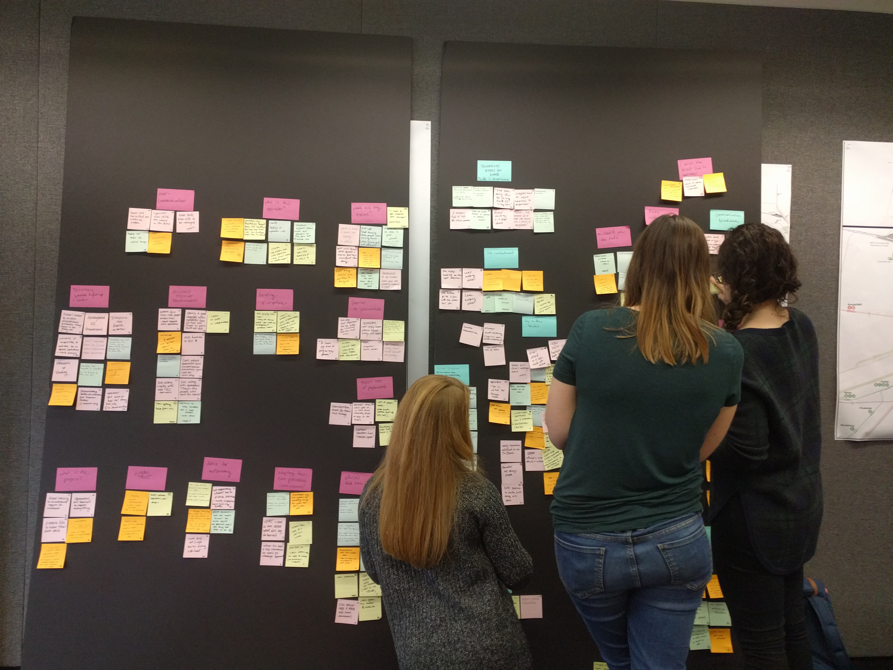
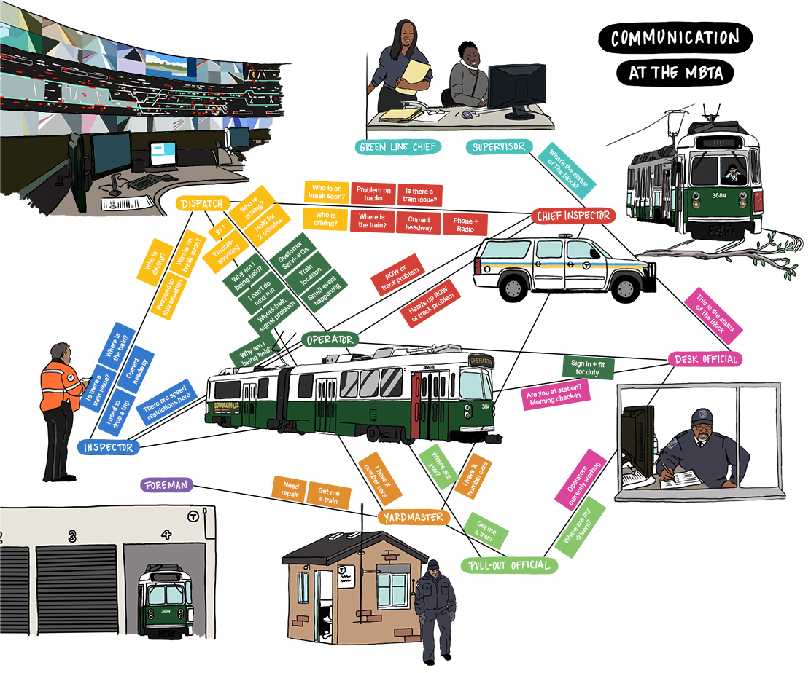
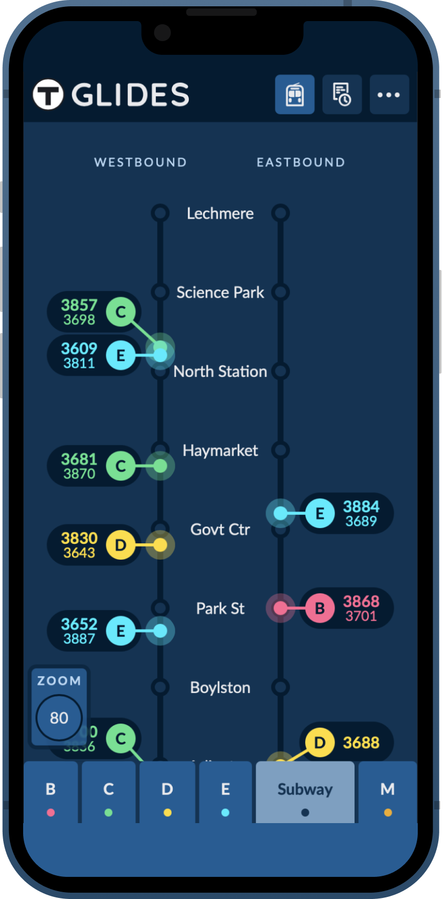
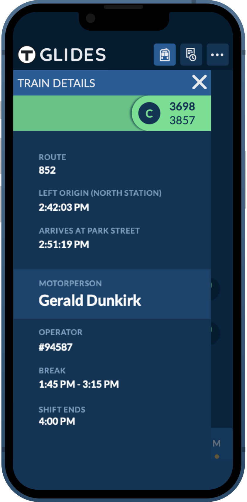
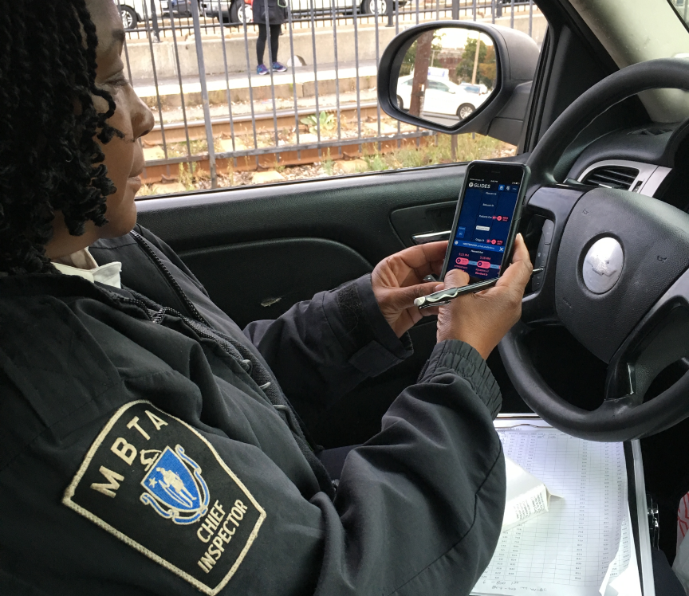
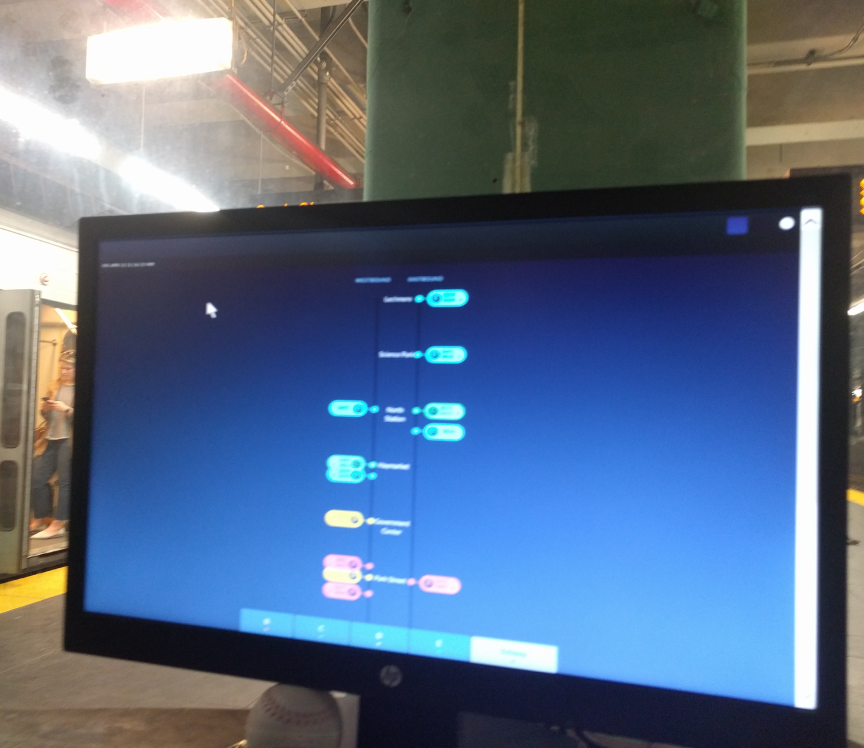

  

  

    
<strong>My role</strong>

    <ul>
      <li>User research</li>
      <li>User interviews</li>
      <li>Wireframing</li>
      <li>Visual design</li>
    </ul>
  

  

    
<strong>Press</strong>

    <ul>
      <li><a href="https://designmuseumfoundation.org/gliding-to-success/" target="_blank">Design Museum Magazine</a></li>
      <li><a href="https://thoughtbot.com/case-studies/mbta" target="_blank">thoughtbot Case Study</a></li>
      <li><a href="https://medium.com/@katrinalanger/green-means-go-improving-green-line-operations-b831daf7a834" target="_blank">Green Means Go: Improving Green Line Operations</a></li>
    </ul>
  

  

    
<strong>Dates</strong>

    <ul>
      <li>Nov 2017 - Feb 2018</li>
    </ul>
  

<h2 class="work__subhead">The process</h2>

<h3>Immersing ourselves in the process of Green Line operations</h3>

We spent the first several weeks on the scene. We visited employees of varying roles to understand their roles, how they do their jobs, and what information was most important to them to get it done. We learned about the gaps in knowledge that can make decision making slow or hard, which can ultimately impact the service.

  <figure>
    
    <figcaption>Jacques showing Jaclyn how trainsheets work</figcaption>
  </figure>
  <figure>
    
    <figcaption>The control room for the entire MBTA train system</figcaption>
  </figure>

<figure>
  
  <figcaption>Affinity mapping after collecting weeks of collecting data from interviews</figcaption>
</figure>

<figure>
  
  <figcaption>I illustrated a relationship map to show examples of information that's being passed between different roles on the Green Line</figcaption>
</figure>

<h2 class="work__subhead">The (web) app</h2>

<h3>A mobile experience that surfaces real time train information</h3>

We spent the first several weeks on the scene. We visited employees of varying roles to understand their roles, how they do their jobs, and what information was most important to them to get it done. We learned about the gaps in knowledge that can make decision making slow or hard, which can ultimately impact the service.

  <figure>
    
  </figure>
  <figure>
    
  </figure>

<h3>In the wild</h3>

We spent the first several weeks on the scene. We visited employees of varying roles to understand their roles, how they do their jobs, and what information was most important to them to get it done. We learned about the gaps in knowledge that can make decision making slow or hard, which can ultimately impact the service.

  <figure>
    
  </figure>
  <figure>
    
  </figure>

<h2 class="work__subhead">The results</h2>

In the first few weeks of widespread use, the app provided a more equitable, reliable source of information for inspectors and dispatchers.

The app ensured a consistent source of train and operator location information if the radio was needed to communicate disruptions or emergencies. The app improved overall employee morale, inspectors loved the automatic updates to train location. The app is now in use, creating data to help the MBTA improve communications among train officials and to deliver a more reliable service to customers.

