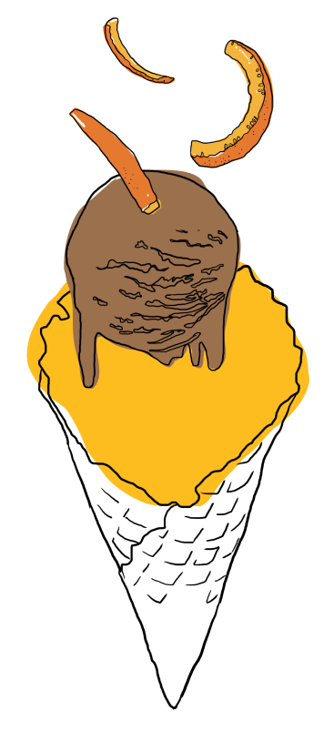
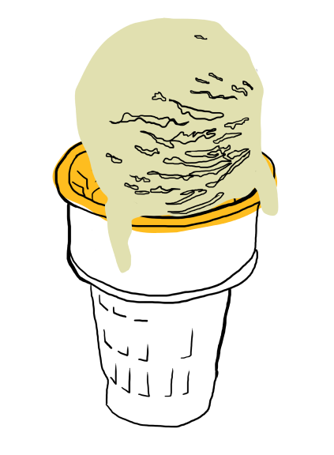
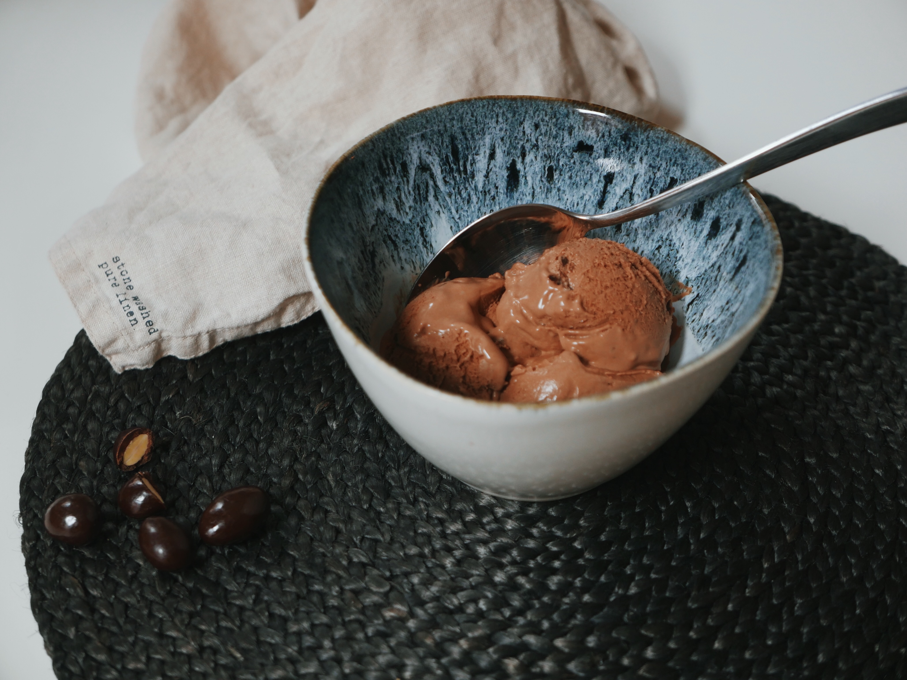
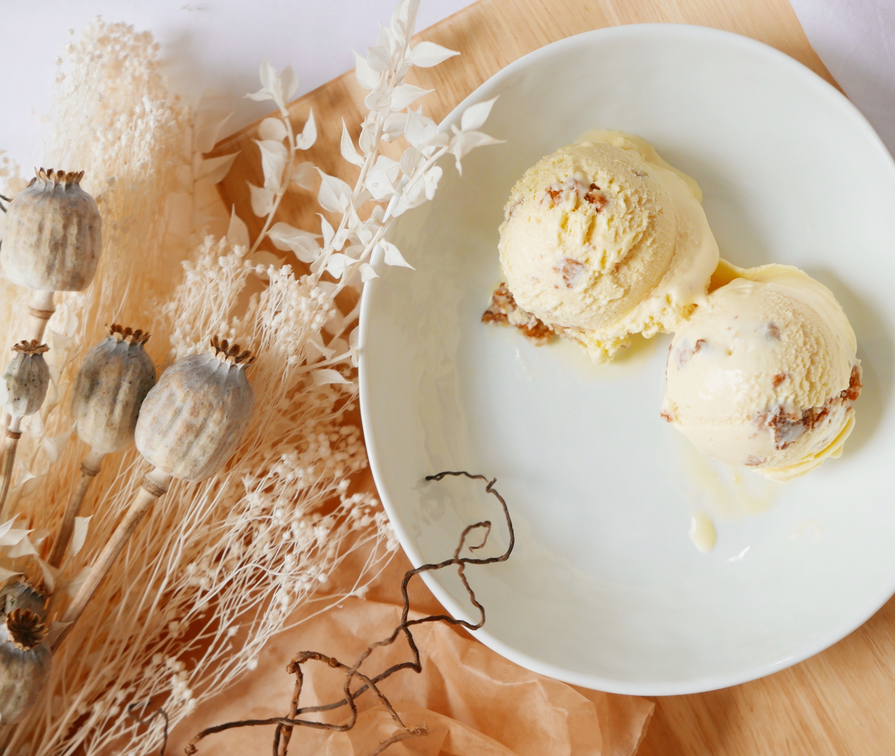
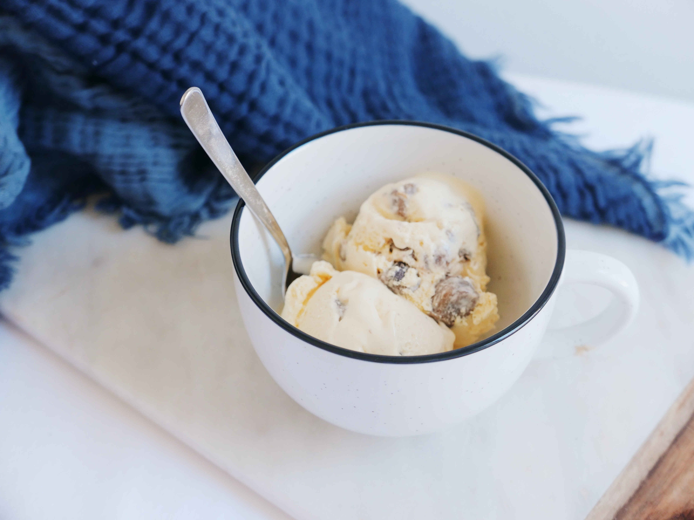
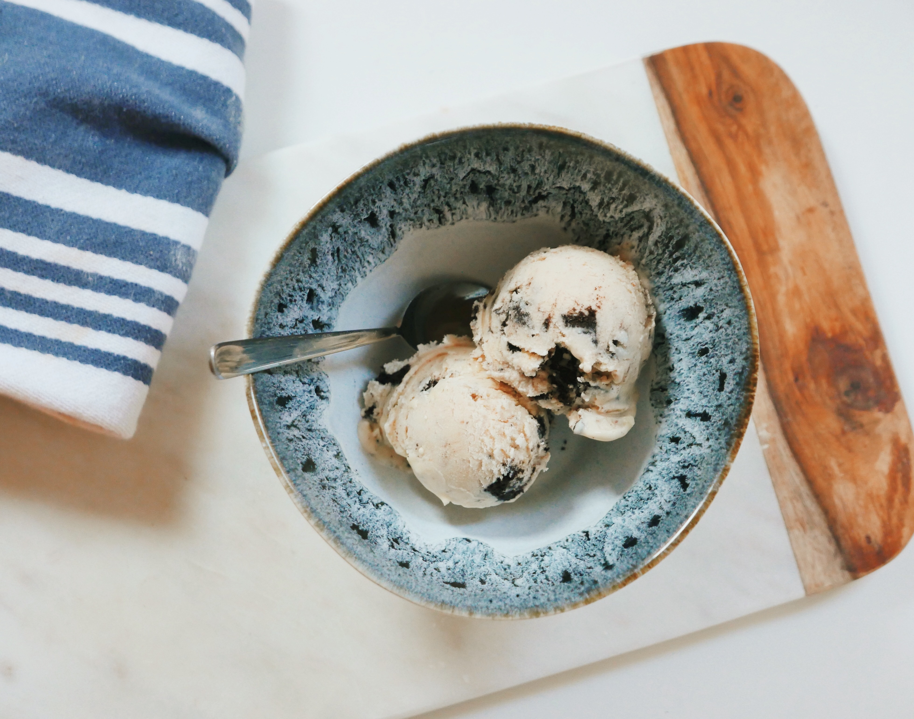
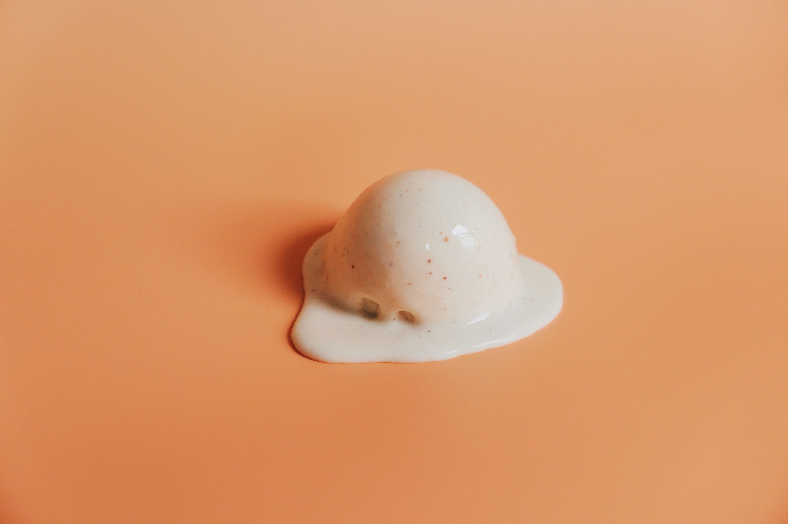
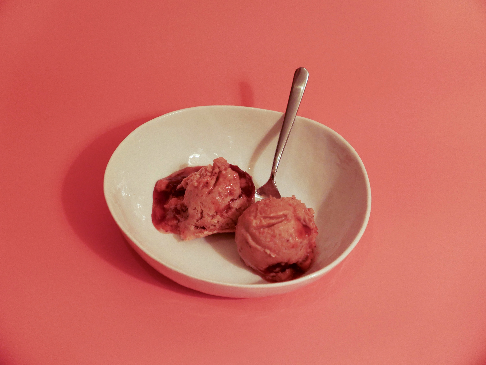
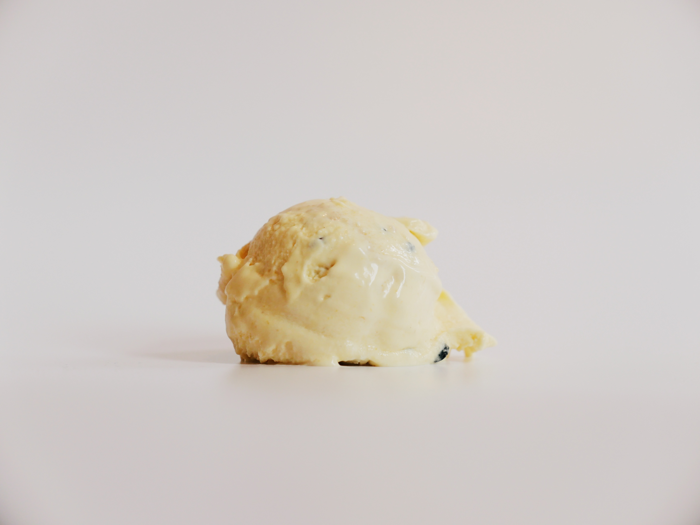
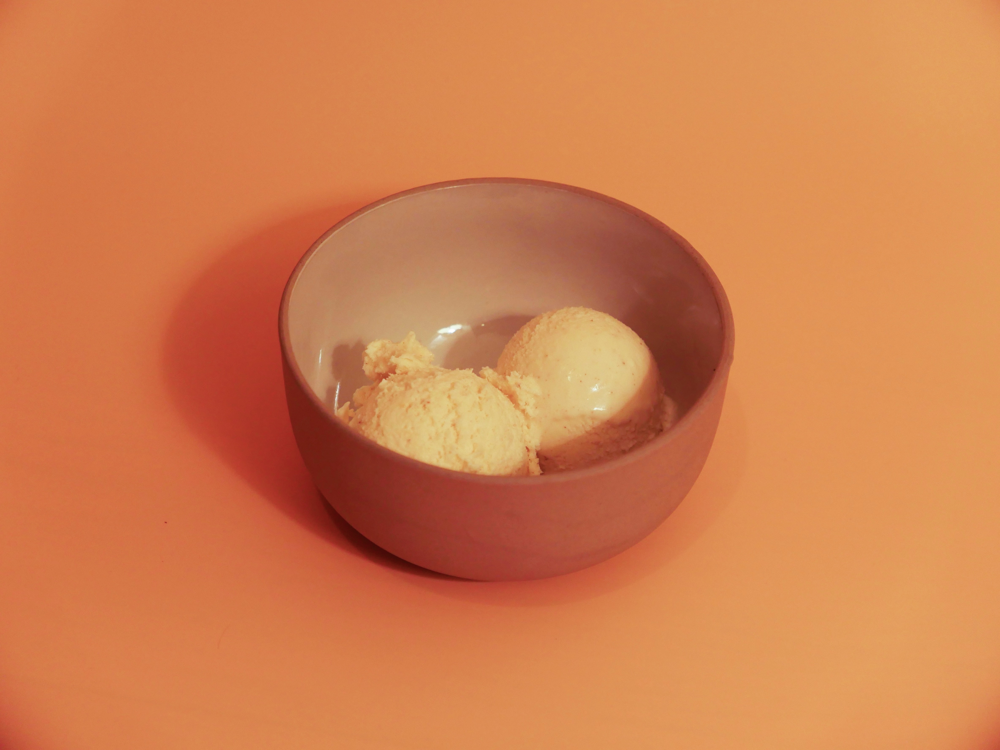

  

    <a href="https://www.icecreamonasunday.com" class="button-link" target="_blank">
      <svg xmlns="http://www.w3.org/2000/svg" class="work__external-link-icon" fill="none" viewBox="0 0 24 24" stroke="currentColor">
        <path stroke-linecap="round" stroke-linejoin="round" stroke-width="2" d="M10 6H6a2 2 0 00-2 2v10a2 2 0 002 2h10a2 2 0 002-2v-4M14 4h6m0 0v6m0-6L10 14" />
      </svg>
      View live site
    </a>
  

  

    
<strong>My role</strong>

    <ul>
      <li>Wireframing</li>
      <li>Visual design</li>
      <li>Implementation</li>
    </ul>
  

  

    
<strong>Tech &amp; tools</strong>

    <ul>
      <li>Sketch</li>
      <li>GatsbyJS</li>
      <li>Contentful CMS</li>
      <li>Styled components</li>
    </ul>
  

  

    
<strong>Dates</strong>

    <ul>
      <li>Fall 2019</li>
    </ul>
  

<h2 class="work__subhead">The illustrations</h2>

  <figure>
    
  </figure>
  <figure>
    
  </figure>
  <figure>
    
  </figure>
  <figure>
    
  </figure>

<h2 class="work__subhead">The photography</h2>

<h3>A changing style to evolve the brand</h3>

While I started off with a very instagram-lifestyle look for the photos, I graduated to a more styled, minimalist view of the scoops to highlight the scoops themselves rather than the setting they were in. It was mostly fun to create the set ups.

  <figure>
    
  </figure>
  <figure>
    
  </figure>

  <figure>
    
  </figure>
  <figure>
    
  </figure>

  <figure>
    
  </figure>
  <figure>
    
  </figure>

  <figure>
    
  </figure>
  <figure>
    
  </figure>

