

  

    <a href="https://www.ressemble.com" class="button-link" target="_blank">
      <svg xmlns="http://www.w3.org/2000/svg" class="work__external-link-icon" fill="none" viewBox="0 0 24 24" stroke="currentColor">
        <path stroke-linecap="round" stroke-linejoin="round" stroke-width="2" d="M10 6H6a2 2 0 00-2 2v10a2 2 0 002 2h10a2 2 0 002-2v-4M14 4h6m0 0v6m0-6L10 14" />
      </svg>
      View live site
    </a>
  

  

    
<strong>My role</strong>

    <ul>
      <li>Lead design sprints and discussions</li>
      <li>Visual design</li>
      <li>HTML/SCSS implementation</li>
    </ul>
  

  

    
<strong>Tech &amp; tools</strong>

    <ul>
      <li>Miro</li>
      <li>Figma</li>
      <li>Elixir</li>
      <li>HTML</li>
      <li>Tailwind CSS</li>
    </ul>
  

  

    
<strong>Dates</strong>

    <ul>
      <li>March 2021 - present</li>
    </ul>
  

<h2 class="work__subhead">Call debriefs</h2>

  <figure>
    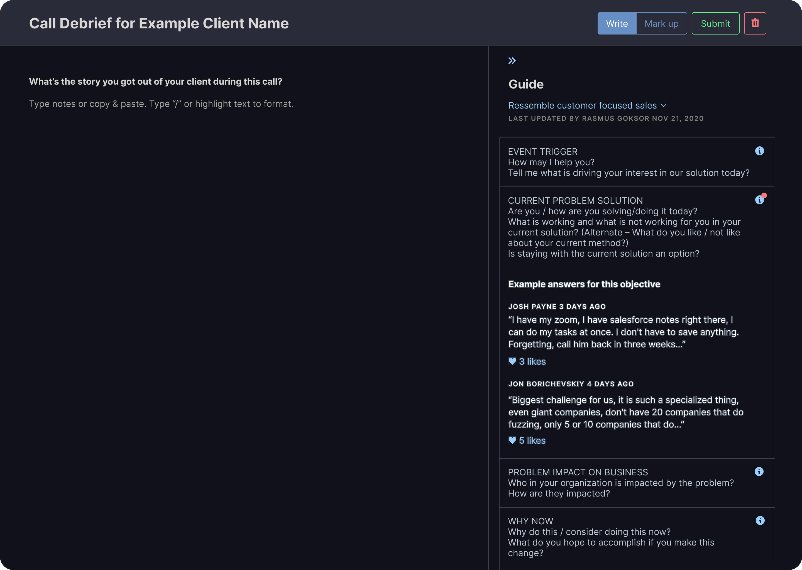
    <figcaption>Empty debrief</figcaption>
  </figure>
  <figure>
    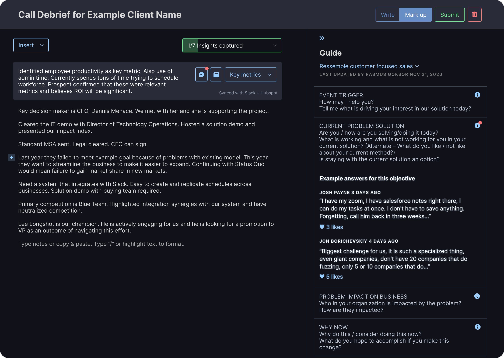
    <figcaption>In-progress debrief</figcaption>
  </figure>

<h3>Making call notes actionable</h3>

By giving users quick access to key actions we are able to teach sales teams that the information they collect is useful beyond notes that refresh your memory. Here we surface comments from a user's team and allow users to schedule reminders concerning a specific note.

<figure>
  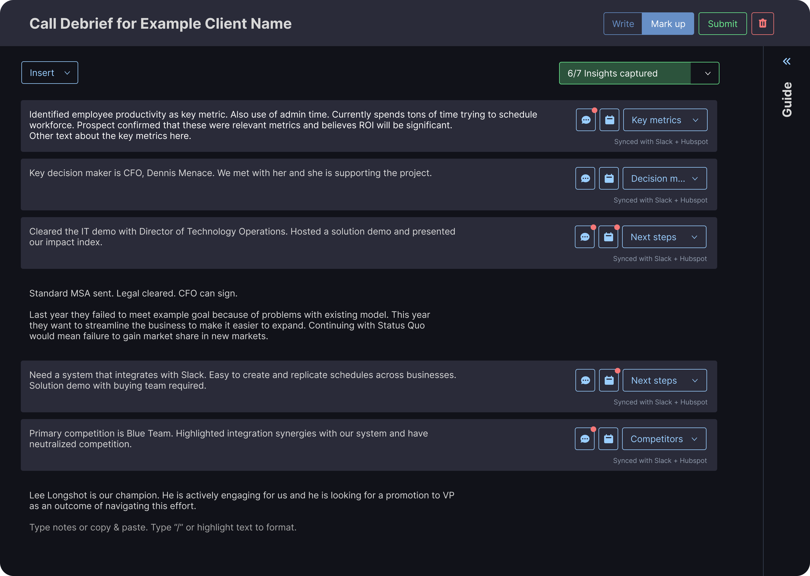
</figure>

<h3>Multiple ways to mark up notes</h3>

Users are unique. Through our testing we found many different working styles and preferences by our users. We provide several entry points for marking up notes to minimize friction.

<figure>
  
</figure>

<h3>Showing progress, building motivation</h3>

Allowing users to see how many objectives they've captured as they go helps motivate them to collect the information necessary to finish it 100%. The guide provides more in-depth descriptions of the objectives themselves.

<figure>
  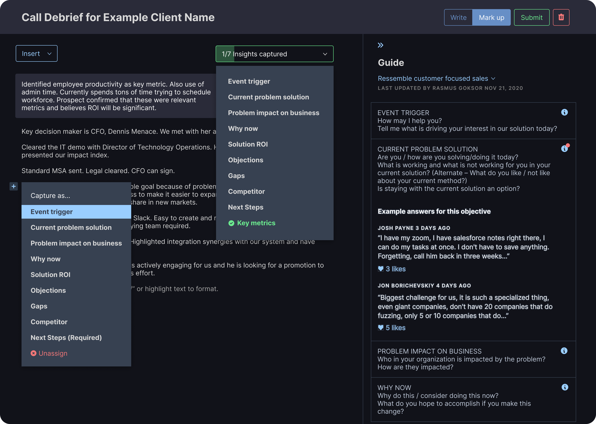
</figure>

<h2 class="work__subhead">Customer summary</h2>

<h3>Focusing on the task at hand</h3>

The objectives and notes are at the forefront here, while the putting the timeline, comments, and details in a tab-able sidebar lets users focus on the task they came to accomplish.

<figure>
  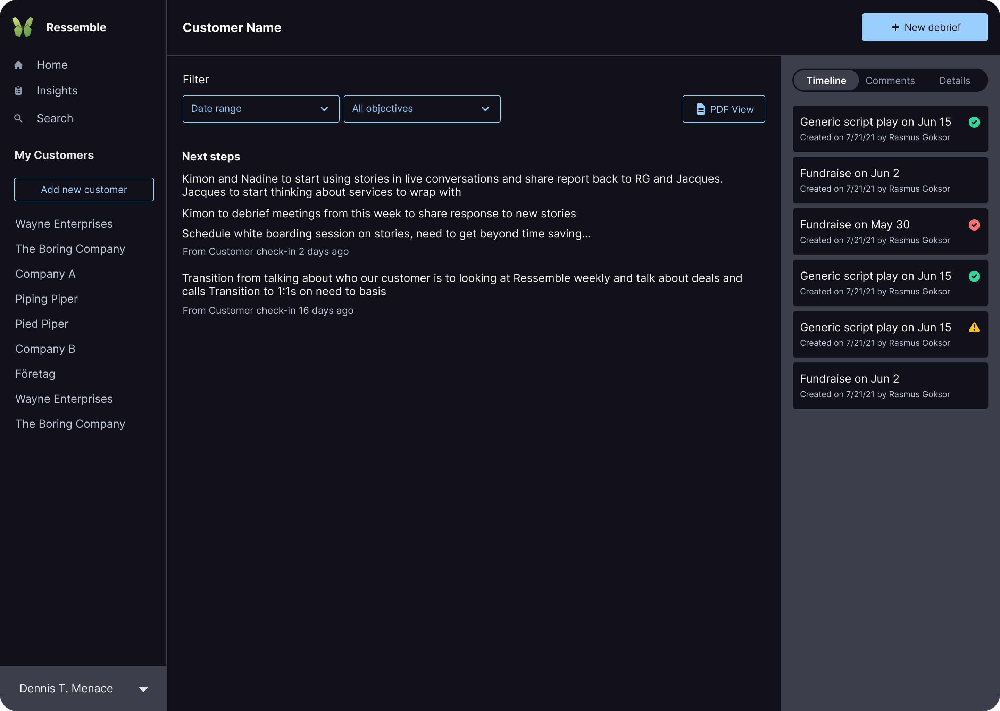
</figure>

<h2 class="work__subhead">Insights report</h2>

<h3>Compact view, easily accessible details</h3>

The objectives and notes are at the forefront here, while the putting the timeline, comments, and details in a tab-able sidebar lets users focus on the task they came to accomplish.

<figure>
  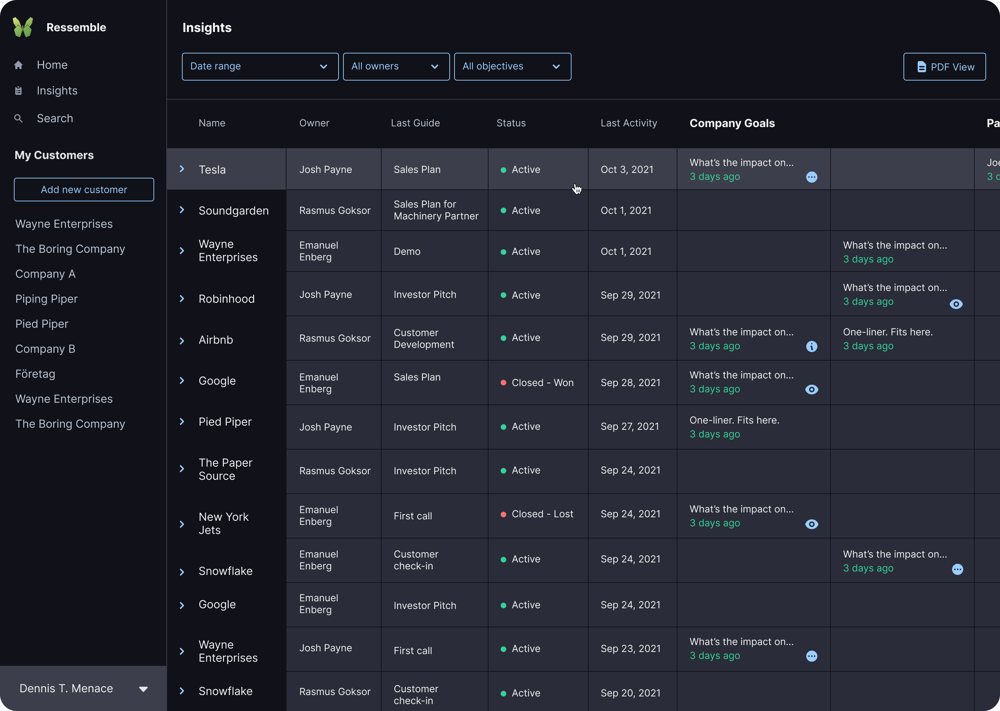
</figure>

<figure>
  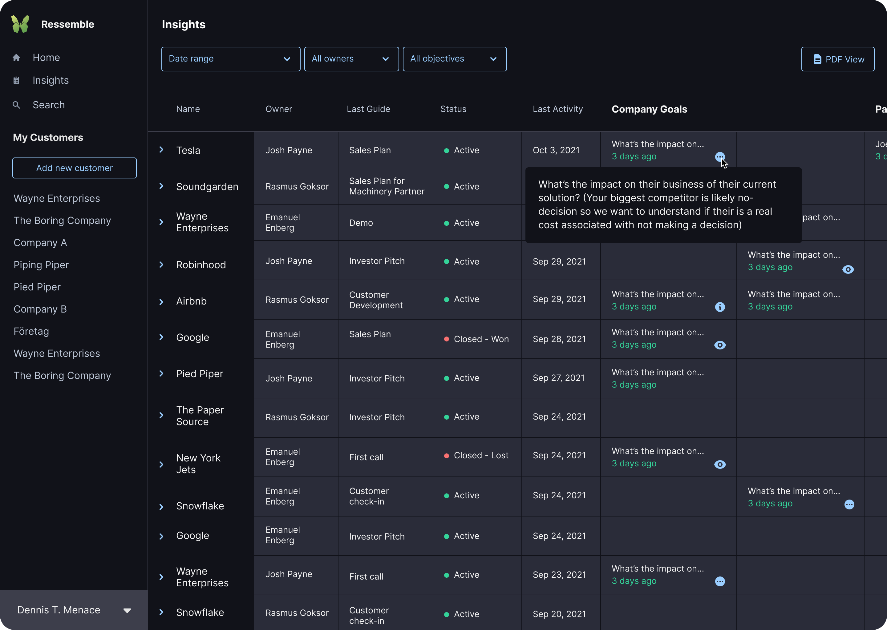
</figure>

<figure>
  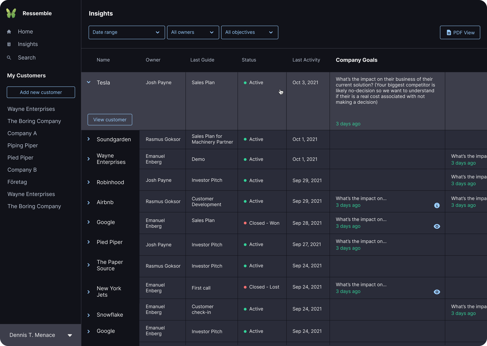
</figure>

<h2 class="work__subhead">The code</h2>

<h3>Repetitive, overly specific styles</h3>

When implementing the designs shown above, one of my main focuses was to utilize Tailwind more to make the styles more DRY (Do not Repeat Yourself). By using the principles of BEM naming conventions I was able to condense the numerous and varying button styles into just two button styles that managed to work for almost all use cases across the app.

<figure>
  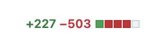
  <figcaption>PRs like this make me happy :)</figcaption>
</figure>

<figure>
  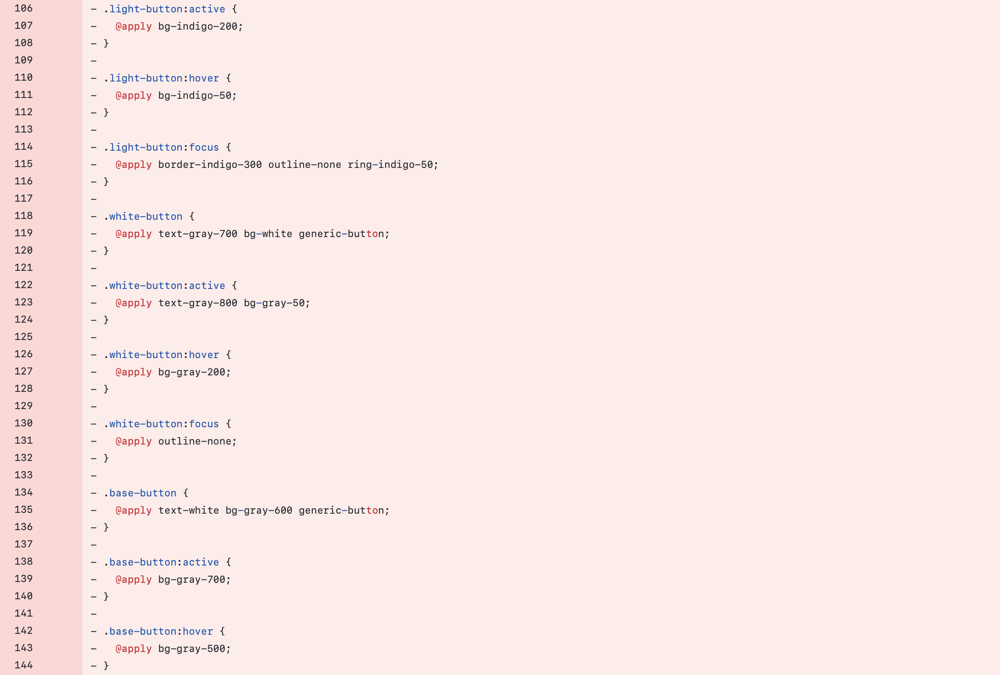
  <figcaption>Before</figcaption>
</figure>

<figure>
  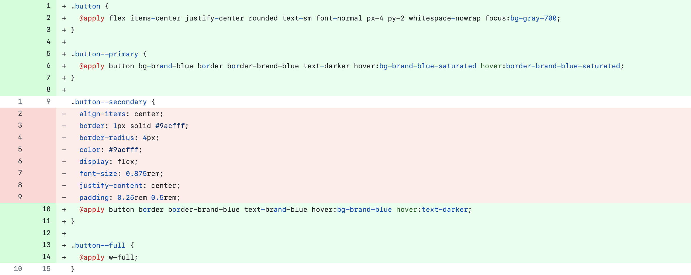
  <figcaption>After</figcaption>
</figure>

<h3>Opaque HTML and monolithic stylesheets</h3>

As a new developer to the project trying to rework the existing HTML, I found that the Tailwind styles were not descriptive enough to let me know what I was looking at in the code.

By reworking the CSS to use BEM naming conventions and creating classes for the styles that contained Tailwind classes we were able to have the best of both worlds. Once refactored, the class names inform other developers of what each element is while still using Tailwind in the stylesheets.

<figure>
  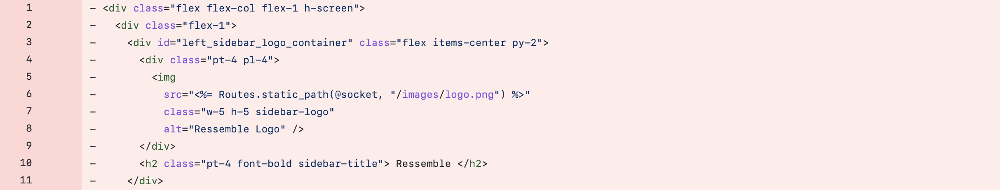
  <figcaption>Before</figcaption>
</figure>

<figure>
  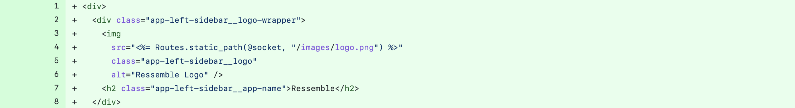
  <figcaption>After</figcaption>
</figure>
